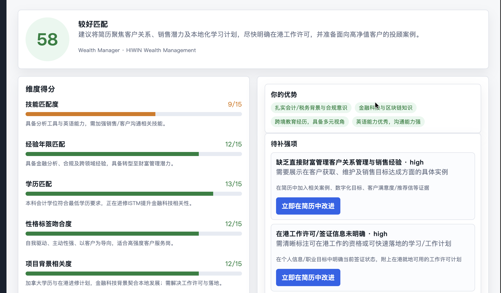

# AI  简历优化+岗位匹配 求职助手💼💻🤖

这是一个 AI 辅助求职网站，支持简历解析、简历诊断、岗位 JD 解析、岗位匹配度评估、定向简历优化、投递追踪面试记录、AI 复盘和成长分析的完整闭环。
前后端自集成一体化操作，需通过命令行指令激活后端，一个指令实现前后端联动，无需分别启动端口操作

项目采用轻量化实现：

- 前端：HTML / CSS / 原生 JavaScript 单页应用
- 后端：Node.js 原生 HTTP Server
- 数据存储：本地 JSON 文件
- 大模型：兼容 OpenAI Chat API /OpenRouter等中转站自选版本的模型服务

## 界面截图




## 功能总览

```text
AI 求职助手
├── 首页
│   ├── 简历档案统计
│   ├── 岗位卡片统计
│   ├── 优化版本统计
│   └── 最近岗位
│
├── 我的简历
│   ├── 简历上传
│   ├── 简历解析
│   ├── 简历诊断
│   ├── 定向优化
│   └── 原版 / 优化版结构化对照
│
├── 我的岗位
│   ├── JD 输入 / 上传
│   ├── JD 解析
│   ├── 岗位画像
│   ├── 匹配报告
│   └── 关联优化简历
│
├── 投递追踪
│   ├── 投递看板
│   ├── 投递详情页
│   ├── 状态更新抽屉
│   ├── 面试微录入
│   ├── AI 单次复盘报告
│   └── AI 成长分析
│
└── 大模型能力
    ├── 简历解析
    ├── 简历诊断
    ├── JD 解析
    ├── 岗位匹配
    ├── 简历优化
    ├── 投递复盘
    └── 成长洞察
```

## 技术栈

### 前端

- HTML
- CSS
- 原生 JavaScript
- 单页应用 SPA
- 无前端框架依赖

### 后端

- Node.js
- 原生 `http` 模块
- 本地文件读写
- OpenAI-compatible API 调用

### 数据存储

项目默认使用本地 JSON 文件：

```text
data/store.json
```

该文件用于保存：

- 用户画像
- 简历版本
- 岗位卡片
- 匹配报告
- 投递记录
- 面试记录
- 复盘报告
- 成长洞察

该文件可能包含真实简历和岗位数据，通常不建议上传到 GitHub。

## 项目结构

```text
.
├── public/
│   ├── index.html
│   ├── app.js
│   └── styles.css
├── data/
│   └── store.json
├── server.js
├── package.json
├── .env
├── .gitignore
└── README.md
```

核心文件说明：

| 文件 | 说明 |
| --- | --- |
| `server.js` | 后端服务、API 路由、大模型调用、文件解析、本地数据持久化 |
| `public/app.js` | 前端单页应用逻辑 |
| `public/styles.css` | 页面样式、布局、动画和响应式适配 |
| `public/index.html` | 前端页面入口 |
| `data/store.json` | 本地业务数据 |
| `.env` | 本地环境变量配置 |


## 环境要求

请先安装：

- Node.js 18+
- npm
- Git

检查命令：

```bash
node -v
npm -v
git --version
```

## 安装项目

克隆仓库，并拉取主体文件同代码：

```bash
git clone git@github.com:l6701w6605/GenAI-Project-Final.git
cd GenAI-Project-Final
```

安装依赖：

```bash
npm install
```

## 配置环境变量

在项目根目录创建 `.env` 文件：

```env
LLM_API_KEY=自己的_API_Key
LLM_BASE_URL=官方模型接口，中转站原生模型接口均可,接口版本号一定要写准确，详情参见模型技术文档
LLM_MODEL=自选模型，模型版本号一定要准确（例如gpt-4.1-nano）
PORT=3000
HOST=127.0.0.1
默认保存为.env文件
模型接入成功后，屏幕选项栏底部将自动解析模型版本号

```

### OpenRouter 配置示例

```env
LLM_API_KEY=你的 OpenRouter API Key
LLM_BASE_URL=https://openrouter.ai/api/v1
LLM_MODEL=openai/gpt-4o-mini
PORT=3000
HOST=127.0.0.1 http://127.0.0.1:3000
模型默认网关为3000，如与你本地程序冲突，请自行修改网关
```

## 启动项目

在项目根目录运行：

```bash
npm run dev
```

启动成功后，终端会显示：

```text
AI job search assistant running at http://127.0.0.1:3000
```

浏览器打开：

```text
http://127.0.0.1:3000
```

前端和后端由同一个 Node.js 服务提供。

## 停止项目

在运行服务的终端中按：

```bash
Ctrl + C
```

如果端口被占用：

```bash
lsof -i :3000
kill <PID>
```

也可以修改 `.env`：

```env
PORT=3001
```

然后重新启动：

```bash
npm run dev
```

## 功能模块说明

## 1. 首页


首页是求职决策工作台，展示：

- 简历档案数量
- 岗位卡片数量
- 优化版本数量
- 平均匹配分
- 当前用户画像
- 最近岗位

首页中的最近岗位支持点击进入岗位详情。

## 2. 我的简历

我的简历模块负责简历上传、解析、诊断和优化。

### 支持上传格式


- PDF （大模型对pdf的解析方式和图片解析规则一致，如果选用pdf文档上传系统，需要运用兼容图片解析的大模型，否则会报错）
- Word `.docx`
- TXT
- Markdown
- 直接粘贴文本

### 独立简历档案


每次上传简历都会形成独立档案，不会默认归为同一个人。

每份简历可以单独：

- 查看诊断
- 生成定向优化
- 查看优化版本
- 与岗位进行匹配

### 简历解析

大模型会将简历解析为结构化用户画像：

- 姓名
- 目标岗位
- 教育背景
- 工作经历
- 技能标签
- 项目经历
- 职业关键词
- 简历摘要

### 简历诊断


系统会生成：

- 简历健康分
- 简历问题列表
- 高 / 中 / 低优先级问题
- 改进建议

### 定向优化


用户可以选择：

- 一份待优化简历
- 一个目标岗位

系统会结合岗位 JD、匹配报告和 Gap 数据生成优化建议。

### 原版 / 优化版对照


优化完成后会展示结构化对照：

- 红色区域：原版需要改动的内容
- 绿色区域：新版修改建议
- 改动原因
- 新增关键词
- 是否由 Gap 数据驱动

## 3. 我的岗位

我的岗位模块以 Job Card 为核心。

### 岗位添加


支持：

- 粘贴 JD 文本
- 上传 JD 文件（建议word文档，上传pdf文档需要选用兼容图片提取功能的大模型）
- 从链接中提取岗位信息（慎用，很多网站有反爬虫机制，大多数链接提取会报错，建议使用前两种方式）

### JD 解析

大模型会解析：

- 公司名称
- 岗位名称
- 工作地点
- 薪资范围
- 必要技能
- 加分技能
- 经验要求
- 学历要求
- 岗位摘要
- 核心考察点

### 匹配分析


系统会结合用户画像和岗位画像生成匹配报告：

- 总匹配分
- 匹配等级
- 技能匹配度
- 经验年限匹配
- 学历匹配
- 性格标签吻合度
- 项目背景相关度
- 优势项
- 待补强项

### 求职决策


岗位详情页支持：

```text
标记为已投递
放弃此岗位
```

这两个动作会同步到投递追踪。

## 4. 投递追踪

投递追踪模块用于管理求职进度。


投递记录不从投递追踪页手动创建，而是从我的岗位中发起：

- 标记为已投递
- 放弃此岗位

### 投递看板

投递看板按状态分组：

- 投递中
- HR筛选通过
- 一面
- 二面
- 终面
- 已发Offer
- 拒绝
- 放弃

点击任意投递卡片，可以进入投递详情页。

### 投递详情页

投递详情页展示：


- 岗位名称
- 公司
- 匹配分
- 投递日期
- 当前状态
- 使用简历版本
- 投递渠道


- 状态历史时间线
- 关联 Job Card
- 关联匹配报告
- 关联 Gap 数据
- 面试记录
- AI 复盘报告

### 状态更新抽屉


点击「更新进度」可以选择新状态：

- 投递中
- HR筛选通过
- 一面
- 二面
- 终面
- 已发Offer
- 拒绝
- 放弃

每次更新都会写入：

```js
status_history
```

如果误选状态，可以回退。系统会清除错误状态之后的时间线。

### 面试微录入


面试记录表单包含：

```text
这轮结果如何？
[通过] [未通过] [待结果]

考察了哪些问题？
[技术题] [行为题] [案例分析] [产品设计] [背景了解]

哪里卡住了？
文本框，可跳过

整体感觉？
1-5 分
```

保存后写入：

```js
interview_rounds
```

这些数据会用于 AI 复盘。

### AI 单次复盘报告


点击「生成复盘」后，系统会分析：

- 匹配分预测是否准确
- 哪些 Gap 可能在面试中暴露
- 主要问题是简历问题、匹配度问题还是面试表现问题
- 下一步应该优化简历、练习题型还是调整选岗方向

报告结构：

```text
1. 结果解读
2. 面试表现分析
3. Gap 验证
4. 行动清单
```

生成过程中会显示居中的环形加载动画。

## 5. 成长分析

当投递记录达到 3 条以上，会解锁成长分析。


成长分析包含：

- 总投递数
- HR 通过率
- 面试通过率
- Offer 数
- 最常被拒阶段
- 平均匹配分
- 高匹配岗位和低匹配岗位表现对比
- 反复出现的 Gap

当前匹配分分组规则：

```text
高匹配：50+
低匹配：<50
```

### AI 成长解读


成长分析页支持生成 AI 解读。

AI 会基于多条投递记录分析：

- 正向规律
- 主要瓶颈
- 推荐策略
- 下一步行动

输出会以表格形式展示。

如果某些字段没有实质内容，例如：

- 依据
- 建议
- 严重度
- 影响

系统会自动隐藏对应列，不显示空列或无意义的 `-`。

生成过程中会显示居中的环形加载动画。

## 大模型调用流程

整体调用流程：

```text
用户点击功能按钮
↓
前端请求后端 API
↓
后端读取 .env 配置
↓
后端拼接 Prompt
↓
调用 LLM_BASE_URL/chat/completions
↓
解析模型返回 JSON
↓
写入 data/store.json
↓
前端刷新展示
```

## 主要 API

### 获取全量状态

```http
GET /api/state
```

### 上传并提取简历文件

```http
POST /api/extract-resume-file
```

### 解析简历

```http
POST /api/analyze-resume
```

请求示例：

```json
{
  "resumeText": "简历文本",
  "fileName": "resume.docx"
}
```

### 上传并提取 JD 文件

```http
POST /api/extract-jd-file
```

### 创建岗位卡片

```http
POST /api/job-cards
```

请求示例：

```json
{
  "jdText": "岗位 JD 文本",
  "inputMethod": "text_paste",
  "createdFrom": "match_module"
}
```

### 生成岗位匹配报告

```http
POST /api/job-cards/:id/match
```

### 定向优化简历

```http
POST /api/optimize-resume
```

请求示例：

```json
{
  "resumeVersionId": "resume_xxx",
  "jobCardId": "job_xxx"
}
```

### 更新投递状态

```http
PATCH /api/applications/:id
```

请求示例：

```json
{
  "currentStatus": "一面",
  "note": "HR 已约一面"
}
```

### 记录面试

```http
POST /api/applications/:id/interviews
```

请求示例：

```json
{
  "roundType": "一面",
  "outcome": "待结果",
  "questionTypes": ["技术题", "行为题"],
  "stuckOn": "案例分析思路不够清晰",
  "performanceRating": 3
}
```

### 生成单次复盘

```http
POST /api/applications/:id/retrospective
```

### 生成成长洞察

```http
POST /api/growth-insights
```

## 敏感文件说明

### `.env`

`.env` 保存本地 API Key，不应该上传 GitHub。

### `data/store.json`

`data/store.json` 保存本地业务数据，可能包含真实简历和岗位数据，通常不应该上传 GitHub。

建议 `.gitignore` 包含：

```gitignore
.DS_Store
.env
data/store.json
node_modules/
```

如果 `.env` 或 `data/store.json` 已经被 Git 跟踪过，需要执行：

```bash
git rm --cached .env data/store.json
```

这不会删除本地文件，只会停止 Git 跟踪。


### 大模型 429 报错

如果看到：

```text
429 当前分组负载已饱和，请稍后再试
```

通常说明模型服务商当前通道繁忙或被限流。

可以尝试：

- 稍后重试
- 更换模型
- 检查 API Key 额度
- 降低连续点击频率

### API Key 不生效

请检查：

- `.env` 是否在项目根目录
- `LLM_API_KEY` 是否正确
- `LLM_BASE_URL` 是否只写到 `/v1`
- 修改 `.env` 后是否重启项目

### 页面没有更新

可以强制刷新：

```text
Cmd + Shift + R
```

或者重启服务：

```bash
Ctrl + C
npm run dev
```

## 当前 MVP 状态

当前已经实现：

- 简历上传
- 简历解析
- 简历诊断
- 简历定向优化
- 原版 / 优化版结构化对照
- JD 上传与解析
- 岗位画像
- 匹配报告
- Gap 分析
- Job Card 管理
- 投递追踪看板
- 投递详情页
- 投递状态更新
- 面试微录入
- AI 单次复盘报告
- 成长分析
- AI 成长解读
- 环形加载动画
- 本地 JSON 数据持久化

